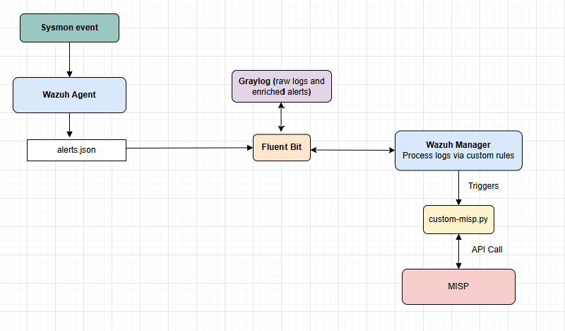
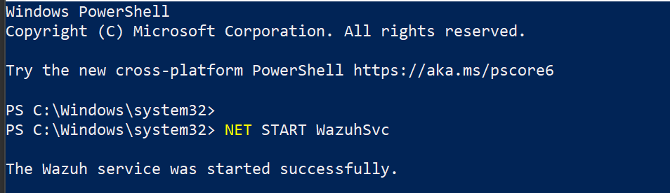
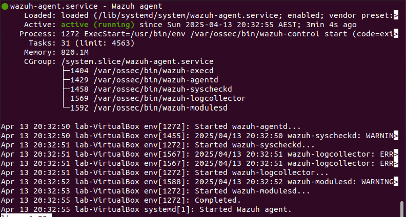
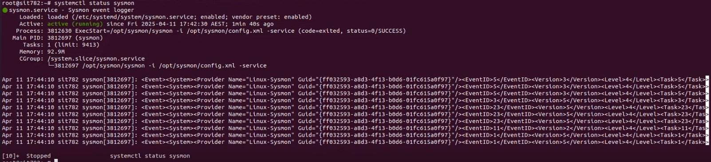
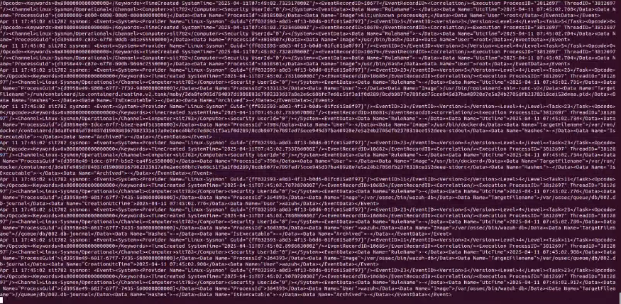
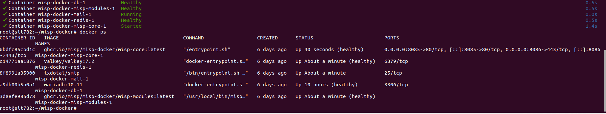
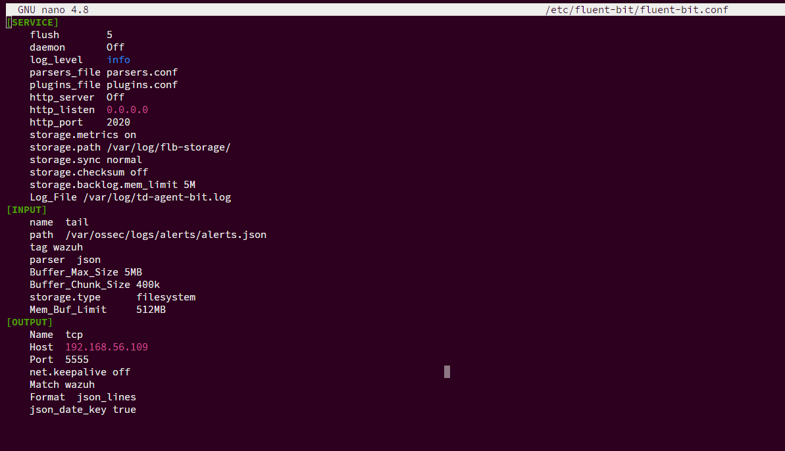
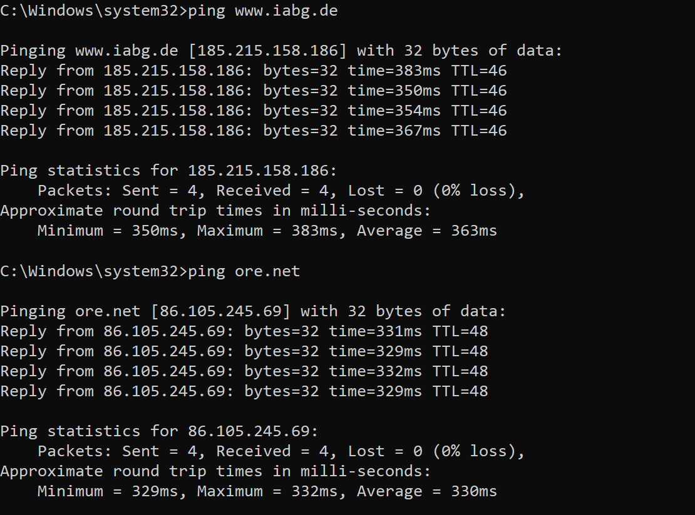
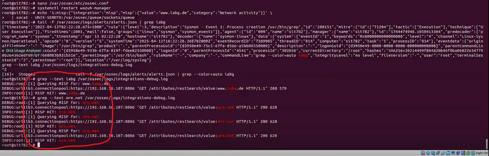
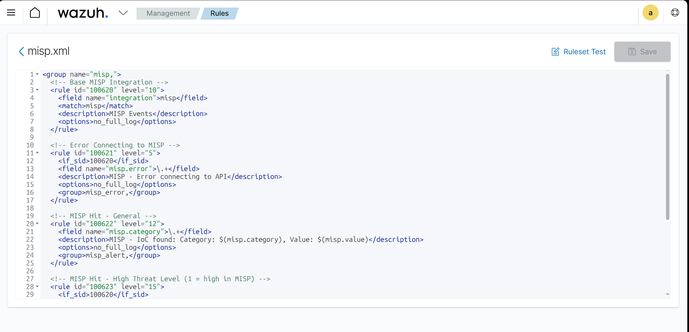

# Wazuh-MISP Integration Progress Report

---
sidebar_position: 1
---
:::info
Document Creation: 2025-04-9. Last Edited: 2025-04-26. Authors: Elvis Ifeanyi Nwosu

Document Code: Wazuh_MISP_Int_V1. Effective Date: 2025-04-26. Expiry Date: 2026-04-26
:::

---

## 1. Executive Summary
This report documents the current status, configuration, and technical progress made in integrating MISP (Malware Information Sharing Platform) with Wazuh and Graylog. The integration aims to enrich Wazuh alerts using threat intelligence from MISP, enabling faster detection of Indicators of Compromise (IoCs). This stack also leverages Graylog to enhance log visualization, normalization, and long-term storage.

---

## 2. Integration Architecture Overview
The integration is composed of the following components:
- **Wazuh Manager**: Collects and processes security logs from agents.
- **MISP**: Provides threat intelligence (IoCs) via its RESTful API.
- **Graylog**: Parses and stores enriched alerts, supports visualization and custom pipelines.
- **custom-misp.py**: A Python integration script executed by Wazuh Manager when a specific rule is triggered.

**Why These Components:**
- Wazuh provides scalable agent-based security monitoring.
- MISP enables correlation of event data with up-to-date threat intelligence.
- Graylog enhances log analysis and dashboard visibility, especially when scaling multiple sources.

 


---


**Snip 1.0 showing Wazuh agent running successfully of Windows endpoint**

---


**Snip 1.1 showing Wazuh agent running successfuly on Linux endpoint**


## 3. Tools and Components
| Component        | Purpose                                                | Current Status              |
|------------------|---------------------------------------------------------|-----------------------------|
| Wazuh Manager    | Analyzes endpoint logs and triggers integration events | Installed and working       |
| Wazuh Agent      | Captures logs (Sysmon on Windows)                      | Active and reporting        |
| MISP (Docker)    | Centralized threat intel sharing platform              | Successfully deployed       |
| Graylog          | Log normalization, indexing, and visual analysis       | Integrated and operational  |
| custom-misp.py   | Script for querying MISP and enriching alerts          | Operational and enhanced    |

**Why These Tools:**
- Wazuh's flexibility supports fine-grained custom rule logic needed for real-time IoC correlation.
- Dockerized MISP setup simplifies portability and version control for team replication.
- Graylog enables full text search and enrichment pipelines crucial for alert triage and investigation.

📷 `Insert: MISP Docker Interface + Graylog Welcome Page`

---

## 4. Configuration & Implementation Steps

### 4.1 Wazuh Agent & Manager Setup
Wazuh manager acts as the central processing point for Sysmon events and executes MISP enrichment.
- Installed Wazuh Manager on Ubuntu VM
- Confirmed receipt of Sysmon logs from Windows and linux agents using sysmonforlinux and packetbeat at the linux endpoint. 
- Enabled JSON alert format for integration (required for MISP script parsing)
- Enabled password-based agent authentication for secure connectivity
  
---


**Snip 1.2 showing packetbeat status on the linux endpoint**

---


**Snip 1.3 showing Network logs generated through packetbeat, these logs are parsed to the Wazuh manager through the Wazuh-agent**

---


**Snip 1.4 demonstrating the generation of symon logs on linux endpoint**

---


**Snip 1.5 showing status of both endpoint agents on Wazuh dashboard**

---


**Snip 1.6 showing Wazuh-alert logs from Linux and windows endpoints captured on Wazuh dashboard**


### 4.2 MISP Deployment (via Docker)
Docker simplifies updates and isolated configuration for MISP and its dependencies.
- Deployed using Docker Compose
- Created admin user and verified API key for secure script access
- Tested access to threat feed events and attribute searches

---


**Snip 1.9 showing Container log of successful MISP-docker startup**

---


**Snip 1.7 showing creation of MISP API key**

---


**Snip 1.8 showing sample threat feeds available on MISP**


### 4.3 Graylog Integration
Graylog was deployed to view the raw and structured form of the alert before enrichment, essential for visibility, troubleshooting, and archival, but to also create alerts on enriched logs that include MISP data.

- Configured Fluent Bit to tail `alerts.json` on Wazuh Manager
- Set up TCP Raw Input on Graylog (port 5555)
- Modified `/etc/fluent-bit/fluent-bit.conf` to match Wazuh alert source
- Configured Graylog extractors to parse enriched fields


**Snip 1.9 showing fluent-bit configured to tail Wazuh**

Full config file below:
```
[SERVICE]
    Flush                 3
    Daemon                Off
    Log_Level             debug
    Parsers_File          /etc/fluentbit/custom_parsers.conf
    Plugins_File          /etc/fluentbit/custom_plugins.conf
    HTTP_Server           On
    HTTP_Listen           127.0.0.1
    HTTP_Port             8888
    Storage.metrics       On
    Storage.path          /var/lib/fluent-bit/buffer/
    Storage.sync          full
    Storage.checksum      On
    Storage.backlog.mem_limit 8M
    Log_File              /var/log/fluentbit/custom.log

[INPUT]
    Name                  tail
    Tag                   ossec.alerts
    Path                  /opt/security/feeds/wazuh-alerts.log
    Parser                json
    Buffer_Max_Size       10MB
    Buffer_Chunk_Size     512k
    Storage.type          filesystem
    Mem_Buf_Limit         1GB
    Skip_Long_Lines       On

[FILTER]
    Name                  grep
    Match                 ossec.*
    Regex                 message .*critical.*

[OUTPUT]
    Name                  http
    Match                 ossec.*
    Host                  monitoring.acme.local
    Port                  9200
    URI                   /alerts/ingest
    Format                json
    Header                Content-Type application/json
    HTTP_User             fluentbit_user
    HTTP_Passwd           s3curePassw0rd
    tls                   On
    tls.verify            Off
    Retry_Limit           False
```
---


**Snip 2.0 showing graylog input setup


  
📷 `Insert Screenshot: Graylog Extractor or Pipeline Rules`  


**Snip 2.1 showing input alerts on graylog**


---

### 4.4 MISP Integration Script
MISP automates threat correlation and return MISP intelligence for further action.
- Location: `/var/ossec/integrations/custom-misp.py`
- Enhanced to support NDJSON format for batch processing (performance and compatibility improvement)
- Sends enriched output back via Wazuh socket
- Uses regex and conditionals to match Event ID types (e.g., Sysmon Event 1, 3, 22)

[Click here to view custom-misp.py employed](https://github.com/karelumair/MISP-Wazuh-Integration/blob/main/custom-misp.py)

The below Integration block added to configuration file `/var/ossec/etc/ossec.conf` this triggers the custom-misp.py script for the select sysmon groups.
```
<integration>
  <name>custom-misp.py</name>
  <group>sysmon_event1,sysmon_event_22,syscheck</group>
  <alert_format>json</alert_format>
</integration>
```



**Snip 2.2 showing sysmon generated event (ping - DNS request) of potential IoC available in MISP**

---


**Snip 2.3 Log of API request and Hit to and fro MISP**

---


**Snip 2.4 showing JSON enriched alert from MISP**


### 4.5 Rule and Decoder Configuration
**Why:** To classify alerts enriched by MISP and assign appropriate severity levels.
- Loaded `misp.xml` with custom rules (e.g., rule ID `100622`)
- Verified integration group contains correct Sysmon events


**Snip 2.4 showing MISP.xml custom rule applied on Wazuh**

 


---

## 5. Troubleshooting & Key Findings

### Key Troubleshooting Performed
| Issue | Why It Mattered | Resolution Attempted | Outcome |
|-------|------------------|------------------------|---------|
| MISP matches not appearing on dashboard | Alerts were being silently dropped | Validated rule 100622 | Only `iabg.de` match triggered successfully |
| Socket communication confirmed but alerts missing | Critical to confirm end-to-end message handoff | Verified `custom-misp.py` socket send format | Socket sends NDJSON; alert not indexed by Wazuh |
| Rule execution trace missing | Needed to confirm rules were parsed and matched | Enabled `ossec.conf` debug mode for the integration block | Confirmed script runs but rule match inconsistent |
| Log enrichment not parsed by Graylog | Prevented visibility of enriched IoC fields | Adjusted extractors and pipeline | Under testing |

📷 `Insert Screenshot: Terminal output from script detecting a known MISP IoC`  
📷 `Insert Screenshot: TCPdump or logger showing alert pushed to socket`  
📷 `Insert Screenshot: Rule debug output from ossec.log`  
📷 `Insert Screenshot: Graylog Pipeline Summary of Failed/Successful Parse`

## 6. Next Steps
- [ ] Review rule inheritance and possible suppression via parent rule conflicts
- [ ] Confirm socket push includes full `integration="misp"` label consistently
- [ ] Add logging/debug section to rule file to identify match failures
- [ ] Test with various endpoint scenarios (file hashes, DNS queries)
- [ ] Add Graylog alerts pipeline for auto-ticketing enrichment

📷 `Insert Screenshot: Roadmap or checklist of next test cases planned`

---

## 7. Technical Contributions
- Developed enhanced MISP-Wazuh integration supporting NDJSON batch alerts
- Reconfigured Fluent Bit + Graylog ingestion pipeline for enriched alerts
- Isolated the only confirmed match with rule ID `100622`
- Automated threat detection using Sysmon Event 22 (DNS queries)

📷 `Insert Screenshot: Enriched alert showing MISP match from Sysmon DNS event`
📷 `Insert Screenshot: Fluent Bit Log showing alert sent to Graylog`

---

## 8. Leadership and Collaboration
- Documented Wazuh and MISP integration steps for peer onboarding
- Guided a team member through initial MISP deployment
- Drafted tutorial script and markdown documentation for upcoming video demo
- Engaged in peer feedback loop for threat intelligence enhancement plans

📷 `Insert Screenshot: Markdown or Confluence Wiki of Documentation`
📷 `Insert Screenshot: Screenshot of team chat or email thread showing peer support`

---

## Appendix
- `custom-misp.py`
- `ossec.conf` integration block
- Rule file `misp.xml`
- Sample NDJSON alert

📷 `Insert Screenshot: Folder view showing configuration files and last modified timestamps`
📷 `Insert Screenshot: Actual NDJSON payload example processed by the script`


